# RAG based recommender system

## Data Pipeline 的驅動流程

### Member 新增至 DB Postgres: `Streamlit`
  1. Upload csv /edit new member data
  2. `pg_conn.update_member_info`
  3. `update_latest_data_to_qdrant`

### Member 資訊更新至 Qdrant: `Airflow` (一小時一次)
  1. Airflow trigger (Hourly)
  2. `dag/dags/update_qdrant.py`
  3. `update_latest_data_to_qdrant`

### Member 媒合推薦結果: Streamlit
1. streamlit update member no
2. `recommend_member_by_id`
3. `get_recommend_member_by_id`

## 系統需求
 
> - [x] 為已滿足

1. [x] 媒合機制 : 以向量空間計算相似度撈取最相似的 Top 5 Member, 並給LLM 進行排序
2. [x] 資料來源 : 透過 Streamlit 上傳 Member 資訊至 PG
3. [x] 資料擴增 : 利用Langgraph 建立 `MemberInfoEnhanceAgent`, 並透過 langchain DuckDuckGoSearchResults API 撈取公司&Linkedin資訊 來進行 Summary
4. [x] 使用RAG : 在 `Candidation` 階段時模型進行推薦
5. [x] 自動化 : 透過 Airflow 定時更新向量資料庫
6. [x] 多策略 : PG `Version`欄位建立不同版本以及其對應Flag; `Qdrant` collection 建立不同版本的向量資料庫進行推薦
7. [ ] *效果評估* : 目前並未建立效果評估機制，但可透過 `Recsys` 進行推薦結果的評估
8. [x] 差異式 : PG 只會撈去最新的資料進行LLM 資料擴增 更新，Qdrant 透過 `add` 函式進行更新

## 功能亮點
1. redis caching 機制為利用 python decorator 自帶進行緩存
2. 有設計版本，並透過 `Version` 欄位進行不同版本的資料撈取
3. 資料擴增 API Function 為Langgraph LLM Agent 實作
4. 使用 Streamlit 進行 UI 交互上傳
5. 使用框架原因：
    - Airflow: 能夠簡單進行定時更新，並且可以進行 DAG 設計
    - Streamlit: 簡單的 UI 交互，並且可以進行即時更新
    - Qdrant: Vector DB 透過進行向量空間計算
      - 選擇Qdrant理由：
         1. 可簡單透過 `add` 函式即時向量資料庫更新
         2. 為 `apache-licensed`
         3. 支援 Hybrid search
         4. 支援 LLM

```mermaid
---
config:
  theme: neo-dark
  look: classic
---
graph TD
subgraph 資料擴增API
    Member資訊-->Linkedin_site_url-->LLM_websearch_API擴展
    Member資訊-->Company_site_url-->LLM_websearch_API擴展
    LLM_websearch_API擴展-->人員資訊敘述
end

subgraph 資料處理層
    Streamlit --> 上傳資料 --> PG_DB[Postgre]
    subgraph 上傳資料
    InputData[上傳Excel]
    MemberData[上傳Member資訊]
    end
    PG_DB[Postgre] --Airflow Trigger--> DataEnhance[資料擴增] --by Version--> VectorDB_[向量資料庫]
    VectorDB_[向量資料庫] --> Recsys[推薦系統] --> Redis[Redis Cache]
    DataEnhance[資料擴增]

end

subgraph 向量資料庫
    MemberItem --Version V1 --> Collection_v1
    MemberItem --Version V2 --> Collection_v2
    MemberItem --Version V2 --> Collection_v3
    subgraph Qdrant[Qdrant]
    Collection_v1[Collection V1]
    Collection_v2[...]
    Collection_v3[Collection V3]
    end
end

subgraph LLM推薦系統
    recMemberInfo[Member輸入資訊]-->VectorDB_Rec[向量資料庫]-->Candidation[候選引擎，撈取最相似的5個 Member]-->Ranking[排序引擎，讓LLM根據目標與候選 member 的 Summary決定]-->reson[推薦結果＆原因]
end
```

